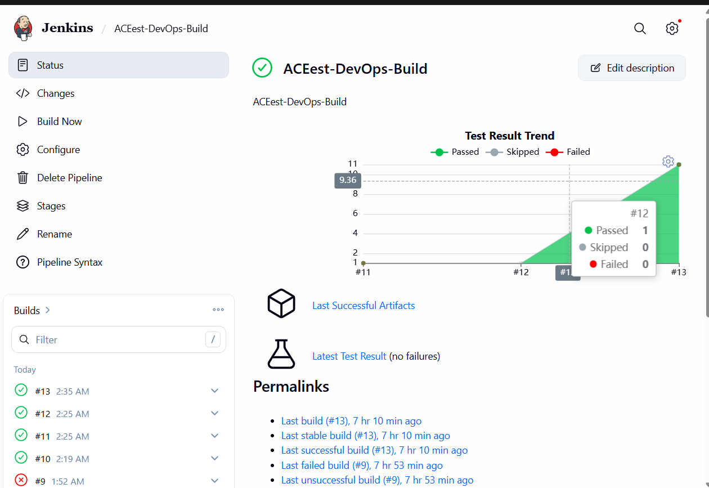

# ACEest Fitness API

Flask + SQLite REST API for gym operations: programs, clients, workouts, analytics (adherence, weight, BMI), CSV/PDF export, admin login, rule-based “AI” weekly plans, and membership fields. Built for BITS-style DevOps coursework (Git, GitHub Actions, Jenkins, Docker).

Assignment 2 extends the Assignment 1 baseline from `https://github.com/akdubey23/ACEest_Devops` and publishes the CI/CD deliverables in `https://github.com/akdubey23/ACEest_Devops_Assig2`.

---

## Quick start

**Needs:** Python 3.10+, `pip`.

```bash
python -m pip install -r requirements.txt
python app.py
```

- **URL:** `http://127.0.0.1:5000` (binds `0.0.0.0:5000`).
- **DB:** `aceest_fitness.db` in the working directory, or set `ACEEST_DB_PATH` to a full path (tests use a temp file via this variable).

```powershell
# Windows PowerShell
$env:ACEEST_DB_PATH = "C:\data\aceest.db"; python app.py
```

---

## Stack

| Piece | Role |
|-------|------|
| Flask | HTTP API |
| SQLite | Persistence (`sqlite3` stdlib) |
| fpdf2 | PDF reports |
| pytest | Tests (e2e + feature-style suites, optional Allure/HTML/JUnit in CI) |

---

## API (summary)

Errors: JSON `{"error": "..."}` with an appropriate HTTP status.

| Area | Method | Path | Purpose |
|------|--------|------|---------|
| Meta | GET | `/` | Metadata, phase, endpoint list |
| Meta | GET | `/health` | Liveness |
| Programs | GET | `/programs` | List programs |
| Programs | GET | `/programs/<name>` | One program |
| Clients | GET | `/clients` | List |
| Clients | POST | `/clients` | Create |
| Clients | GET | `/clients/<name>` | Read latest by name |
| Clients | PATCH | `/clients/<name>` | Partial update |
| Clients | GET | `/clients/export.csv` | CSV export |
| Clients | GET | `/clients/<name>/report.pdf` | PDF report |
| Analytics | GET | `/analytics/adherence` | Chart data (all clients) |
| Analytics | GET | `/analytics/adherence/<client_name>` | Per-client series |
| Analytics | GET | `/analytics/weight-trend?client_name=` | Weight from metrics |
| Analytics | GET | `/bmi?client_name=` | BMI / category |
| Workouts | POST | `/workouts` | Log workout (+ optional exercises) |
| Workouts | GET | `/workouts?client_name=` | List |
| Metrics | POST | `/metrics` | Log weight / waist / bodyfat |
| Auth | POST | `/auth/login` | JSON `username`, `password` |
| AI | POST | `/ai/program` | JSON `client_name`, `experience` |
| Membership | GET | `/membership/status?client_name=` | Status + end date |

---

## Tests

```bash
python -m pytest tests/ -v
```

`tests/test_final_e2e.py` walks the main routes on an isolated DB. `tests/test_api_features.py` groups scenarios by feature (Allure-friendly). CI also writes JUnit / HTML / Allure under `test-results` and `allure-results` when using the pipeline commands in `Jenkinsfile` / workflow.

---

## Docker

```bash
docker build -t aceest-fitness-api:local .
docker run -p 5000:5000 aceest-fitness-api:local
```

Image runs `python app.py` on port **5000** inside the container.

---

## Branching workflow

```
master     — stable line; tagged releases (e.g. v1.0.0) for submission snapshots
develop    — integration before master; day-to-day merges land here first
feature/*  — optional topic branches (example: feature/ci-staging)
```

Typical flow: **`feature/*` → `develop` → `master`**. Phase history is also captured as **`phase-*`** annotated tags on older commits (see below), not only branch tips.

---

## Git tags (phases)

| Tag | Milestone |
|-----|-----------|
| `phase-1-v1.0` | Baseline catalog API |
| `phase-2-v1.1.2` | In-memory clients + CSV |
| `phase-3-tests` | Pytest + requirements (pre-SQLite) |
| `phase-4-v2.0.1` | SQLite clients |
| `phase-5-stabilization` | Stabilization / metadata |
| `phase-6-v2.2.1` | Adherence / progress chart |
| `phase-7-v2.2.4` | Workouts + metrics |
| `phase-8-auth-ai-pdf` | Auth, AI plan, PDF |
| `phase-9-membership` | Membership |
| `phase-10-v3.2.4` | Phase-10 / v3.2.4 baseline |
| `v1.0.0` | Submission snapshot (CI, tests, docs, screenshots) |

List locally: `git tag -l -n1`.

---

## Assignment 2 CI/CD

| System | What it does |
|--------|----------------|
| **GitHub Actions** (`.github/workflows/main.yml`) | On push / PR: deps, `compileall`, pytest + coverage/reports, optional SonarQube scan, Docker test image, runtime image, optional Docker Hub push. |
| **Jenkins** (`Jenkinsfile`) | SCM polling, checkout, install (Windows uses `scripts/jenkins-windows-ci.cmd` + optional `PYTHON_JENKINS`), pytest + coverage/reports, optional SonarQube quality gate, containerized tests, Docker build, staging smoke, optional Docker Hub push, optional Kubernetes deploy. |
| **SonarQube** (`sonar-project.properties`) | Static analysis project configuration and coverage import from `test-results/coverage.xml`. |
| **Kubernetes** (`k8s/`) | Minikube-ready base deployment plus rolling, blue-green, canary, shadow, and A/B strategy manifests. |

### Jenkins knobs

The Jenkinsfile is safe to run without external accounts first. Enable the external stages after setup:

| Variable | Default | Purpose |
|----------|---------|---------|
| `SONARQUBE_ENABLED` | `false` | Set `true` after configuring Jenkins SonarQube server name `SonarQube` and `sonar-scanner`. |
| `DOCKERHUB_IMAGE` | `akanksha2402/aceest-fitness-api` | Replace with your Docker Hub repository. |
| `PUSH_IMAGE` | `false` | Set `true` after creating Jenkins credentials id `dockerhub-credentials`. |
| `KUBE_DEPLOY_ENABLED` | `false` | Set `true` after `kubectl` points to Minikube/Kubernetes. |

### Kubernetes quick deploy

```powershell
minikube start
.\scripts\k8s-deploy.ps1 -Image "docker.io/<dockerhub-user>/aceest-fitness-api:<tag>"
minikube service aceest-fitness-api -n aceest
```

Strategy examples:

```powershell
.\scripts\k8s-deploy.ps1 -Strategy rolling
.\scripts\k8s-deploy.ps1 -Strategy blue-green
.\scripts\k8s-deploy.ps1 -Strategy canary
.\scripts\k8s-deploy.ps1 -Strategy shadow
.\scripts\k8s-deploy.ps1 -Strategy ab
```

See `docs/ASSIGNMENT2_REPORT.md` for the 2-3 page report, tool dependency checklist, manual setup steps, and rollback commands.

---

## Evidence (screenshots)

Files live in **`assets/screenshots/`** (exact names). Jenkins needs **two different** PNGs: stage graph vs test/console.

| File | Content |
|------|---------|
| `Jenkins pipeline stages.png` | Stage graph |
| `Jenkin_Test.png` | Test Result or console (not a duplicate of the file above) |
| `GitHub Actions workflow.png` | Actions run |
| `Docker image build.png` | `docker build` |
| `Docker container run.png` | `docker run` |
| `Health check.png` | `/health` |

### Jenkins




### GitHub Actions


### Docker


### API


---

## Commit convention

| Prefix | Use for |
|--------|---------|
| `feat:` | New endpoint or behaviour |
| `fix:` | Bug or regression |
| `refactor:` | Internal change, same behaviour |
| `test:` | Tests only |
| `ci:` | Jenkins, Actions, Docker CI |
| `docs:` | README, comments aimed at readers |
| `chore:` | Tooling, deps, housekeeping |
